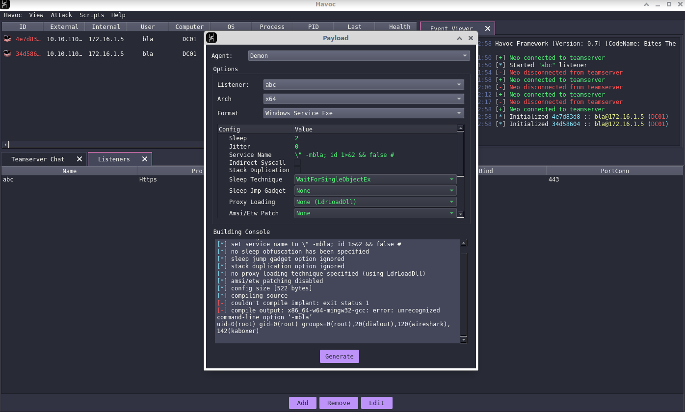

# Havoc RCE

Havoc is vulnerable to command injection enabling an authenticated user to execute commands on the Teamserver. Affects versions 0.3 up to the latest release 0.6.

The Havoc Teamserver can compile custom agents on behalf of users. The [builder code](https://github.com/HavocFramework/Havoc/blob/ea3646e055eb1612dcc956130fd632029dbf0b86/teamserver/pkg/common/builder/builder.go) eventually passes the full compilation options to an `exec.Command()` [invocation of `sh -c`](https://github.com/HavocFramework/Havoc/blob/ea3646e055eb1612dcc956130fd632029dbf0b86/teamserver/pkg/common/builder/builder.go#L1066). Input options are sanitized, apart from the ["Service Name" field](https://github.com/HavocFramework/Havoc/blob/ea3646e055eb1612dcc956130fd632029dbf0b86/teamserver/pkg/common/builder/builder.go#L617) when generating service binaries.

## Reproduction

The `havoc_rce.py` PoC script automates the following steps and provides a pseudo shell (just set the variables at the top).

1. In the Havoc client UI, View > Listeners > Add (settings don't matter)
2. Go to Attack > Payload > Format Windows Service Exe
3. The injection is in the "Service Name" field, and should look something like `\" -mbla; CMD 1>&2 && false #`:
  - `\"` to exit out the quotes 
  - `-mbla` to cause the MinGW compilation to fail and not have to wait for it
  - `CMD 1>&2` with the chosen payload redirected to stderr
  - `&& false` to cause the command to fail and the server to send back the stderr output
  - `#` to comment out the parameters after our injection

